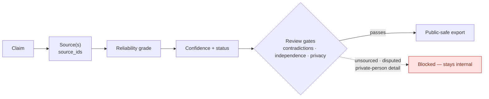
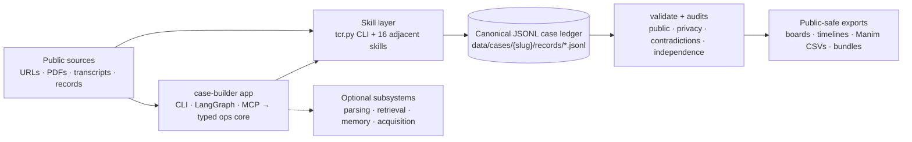

<p align="center">
  
</p>

<h1 align="center">Crime Research Kit</h1>

<p align="center">
  Use LLMs as research assistants for historical criminal research.
</p>

<p align="center">
  <a href="#the-evidence-chain">Evidence chain</a> |
  <a href="#choose-your-path">Choose your path</a> |
  <a href="#quick-start">Quick start</a> |
  <a href="#architecture-at-a-glance">Architecture</a> |
  <a href="#public-interest-boundaries">Safety</a> |
  <a href="#documentation-and-development">Docs</a>
</p>

CRK is a **local-first** research kit for public-interest, documentary-style
work on true crime, high-control groups, cult-origin networks, missing-person
leads, and public records. It moves an agent or researcher from a pile of
articles, transcripts, PDFs, and archive links into a structured case ledger
where every claim points back to its sources, reliability grade,
confidence/status, privacy review, and export decision.

**This is neither a rumor engine nor a way for individuals to dox people.** AI can organize, search, OCR, index, and draft
extraction packets, but **AI-generated summaries are never evidence.** A claim
becomes public-facing only after source support, validation, contradiction
review, source-independence review, and privacy review.

## The evidence chain

Every public-facing claim must reduce to the chain below. If any link breaks —
no source, unresolved contradiction, private-person detail, failed privacy
review — the claim stays out of the public output.



The record-level contract behind this chain is documented in
[Case Ledger](docs/guides/architecture/case-ledger.md).

## Choose your path

| I am a…                          | What you get                                                                                                                     | Start here                                                                                                                                                                                                                                                                        |
| -------------------------------- | -------------------------------------------------------------------------------------------------------------------------------- | --------------------------------------------------------------------------------------------------------------------------------------------------------------------------------------------------------------------------------------------------------------------------------- |
| **Researcher**                   | A local case workspace, the `tcr.py` ledger CLI, repo-local skills, staged extraction packets, audits, and public-safe exports.  | [Case Workflow](docs/guides/runbooks/cases/case-workflow.md) · [Agent Skills](docs/guides/integrations/agent-skills.md) · [Export Artifacts](docs/guides/runbooks/outputs/export-artifacts.md) · [Public Output Readiness](docs/guides/runbooks/cases/public-output-readiness.md) |
| **Operator**                     | A self-hosted local stack: SearXNG discovery, Qdrant retrieval, Ollama runtime, OCR, MCP, and the case-builder app.              | [Initial App Install](docs/guides/runbooks/setup/install.md) · [Self-Hosted Deployment](docs/guides/runbooks/setup/self-hosted-deployment.md)                                                                                                                                     |
| **Developer / agent integrator** | The MCP server, the `src/` app boundary and typed ops core, the skill API contract, and the skill invocation model. | [System Overview](docs/guides/architecture/system-overview.md) · [Case Builder & LangGraph](docs/guides/architecture/case-builder-langgraph.md) · [MCP Server](docs/guides/integrations/mcp-server.md) · [Skill API Spec](docs/guides/skill-api-spec.md)                                      |

New to the kit? Read [the evidence chain](#the-evidence-chain) and
[public-interest boundaries](#public-interest-boundaries) first as they define
what CRK will and will not produce.

## Quick start

Install the dev environment, verify against the tracked synthetic case, and
create your first case:

```bash
moon run crk:install-dev
python .agents/skills/truecrime-cult-research/scripts/tcr.py validate data/examples/synthetic_case
python .agents/skills/truecrime-cult-research/scripts/tcr.py init-case data/cases/sample_case --title "Sample Case"
```

Missing `moon`? Bootstrap the minimum toolchain first — it installs
[proto](https://moonrepo.dev/proto) plus the `moon` and `python` versions
pinned in `.prototools`:

```bash
./deployment/scripts/bootstrap.sh      # Linux / macOS
```

```powershell
.\deployment\scripts\bootstrap.ps1     # Windows
```

From there, ingest URLs, draft and import extraction packets, run audits, and
export. The full source-review loop is in the
[Case Workflow runbook](docs/guides/runbooks/cases/case-workflow.md); manual
install, optional extras, retrieval, OCR, and memory setup are in
[Initial App Install](docs/guides/runbooks/setup/install.md).

## Architecture at a glance

Two implementation layers share one canonical JSONL ledger: the
standard-library-only skill CLI (`tcr.py` plus sixteen adjacent domain
skills), and the `src/` agent app whose frontends (CLI,
LangGraph, MCP) go through a typed ops core. Retrieval indexes, workflow
memory, and parse artifacts are optional, rebuildable, and never evidence.



The full write-up including layer boundaries, optional subsystems, data flow, and
design invariants, is in
[System Overview](docs/guides/architecture/system-overview.md).

## What you can build

| Goal                       | CRK output                                                                                                                       |
| -------------------------- | --------------------------------------------------------------------------------------------------------------------------------- |
| Source ledger              | `records/sources.jsonl` with URL/path, source type, reliability grade, hashes, archive context, and public/private flags.         |
| Claim matrix               | One assertion per row in `records/claims.jsonl`, tied to source IDs, confidence, status, contradictions, and privacy review.      |
| Timeline                   | Events with date precision, source support, related entities, and Manim-ready CSV export.                                         |
| Relationship graph         | Source-stated entity relationships and event links without inferring guilt, membership, motive, or hidden control from proximity. |
| Contradiction audit        | Reports for corrections, denials, retractions, court findings, disputed dates, and unsupported public claims.                     |
| Source independence review | Detection of repeated wire copy, press-release reuse, shared publishers, and same-source chains.                                  |
| Privacy audit              | Redaction blockers for living private people, minors, addresses, contact info, medical details, and weak allegations.             |
| Public-safe exports        | Evidence boards, Manim CSVs, charts, timelines, and public-safe bundle exports.                                                   |

## Public-Interest Boundaries

CRK is designed for lawful, public-source research. It is not designed for
harassment, doxxing, private-person targeting, vigilante investigation, or
making unsourced accusations.

Core guardrails:

- Treat every claim as unverified until it has traceable source support.
- Do not label anyone a suspect, perpetrator, accomplice, cult member, or
  person of interest unless a cited official/legal/news source uses that label.
- Do not infer guilt, motive, membership, or hidden control from proximity.
- Keep private addresses, contact details, minor-sensitive details, medical
  details, and weak allegations out of public exports.
- Search for contradictions, corrections, retractions, denials, and
  disconfirming evidence before marking claims as corroborated.

## Documentation and development

The documentation map lives in [docs/README.md](docs/README.md): architecture
notes and the [ledger contract](docs/guides/architecture/case-ledger.md) under
`docs/guides/architecture/`, integration guides under
`docs/guides/integrations/`, operator procedures under
`docs/guides/runbooks/`, JSON Schemas under `docs/schemas/`, and the canonical
lane/template registry under `docs/registry/`. Persistent agent rules live in
`AGENTS.md`.

Validate changes with `make check` (compile + ledger validation) and
`.venv/bin/python -m pytest` (unit, integration, e2e, governance, smoke).
