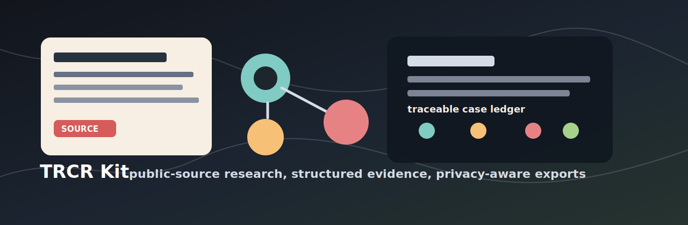

<p align="center">
  
</p>

<h1 align="center">True Crime / Cult-Origin Research Kit</h1>

<p align="center">
  <strong>Turn public sources into source-traceable case files, timelines, relationship graphs, contradiction audits, and video-ready evidence boards.</strong>
</p>

<p align="center">
  <a href="#quick-start">Quick start</a> |
  <a href="#what-you-can-build">What you can build</a> |
  <a href="#example-workflows">Examples</a> |
  <a href="#local-document-retrieval-and-memory-stack">Local stack</a> |
  <a href="#public-interest-boundaries">Safety</a>
</p>

TRCR is a local-first research kit for public-interest, documentary-style work
around true crime, high-control groups, cult-origin networks, missing-person
leads, public records, timelines, and source provenance. It helps an agent or
researcher move from a pile of articles, transcripts, PDFs, and archive links
into a structured case ledger where every claim can point back to sources,
reliability grades, confidence/status, privacy review, and export decisions.

This is not a rumor engine. AI can help organize, search, OCR, index, and draft
extraction packets, but **AI-generated summaries are never evidence**. Claims
only become public-facing material after source support, validation,
contradiction review, source-independence review, and privacy review.

## What You Can Build

| Goal | TRCR output |
| --- | --- |
| Source ledger | `records/sources.jsonl` with URL/path, source type, reliability grade, hashes, archive context, and public/private flags. |
| Claim matrix | One assertion per row in `records/claims.jsonl`, tied to source IDs, confidence, status, contradictions, and privacy review. |
| Timeline | Events with date precision, source support, related entities, and Manim-ready CSV export. |
| Relationship graph | Source-stated entity relationships and event links without inferring guilt, membership, motive, or hidden control from proximity. |
| Contradiction audit | Reports for corrections, denials, retractions, court findings, disputed dates, and unsupported public claims. |
| Source independence review | Detection of repeated wire copy, press-release reuse, shared publishers, and same-source chains. |
| Privacy audit | Redaction blockers for living private people, minors, addresses, contact info, medical details, and weak allegations. |
| Local RAG/context retrieval | Optional local-first parsing, OCR, Qdrant/LlamaIndex retrieval, and workflow memory without hosted vector services. |
| Public/video exports | Evidence boards, Manim CSVs, charts, timelines, and public-safe bundle exports. |

## Public-Interest Boundaries

TRCR is designed for lawful, public-source research. It is not designed for
harassment, doxxing, private-person targeting, vigilante investigation, or
making unsourced accusations.

Core guardrails:

- Treat every claim as unverified until it has traceable source support.
- Do not label anyone a suspect, perpetrator, accomplice, cult member, or
  person of interest unless a cited official/legal/news source uses that label.
- Do not infer guilt, motive, membership, or hidden control from proximity.
- Keep private addresses, contact details, minor-sensitive details, medical
  details, and weak allegations out of public exports.
- Search for contradictions, corrections, retractions, denials, and
  disconfirming evidence before marking claims as corroborated.

## What This Gives You

- A Codex skill at `.agents/skills/truecrime-cult-research/SKILL.md`.
- A repository-level `AGENTS.md` with persistent project rules for Codex.
- JSON schemas under `docs/schemas/` for sources, entities, claims, events,
  event links, relationships, places, artifacts, quotes, source spans, and
  redactions.
- A Python CLI for creating case folders, ingesting URLs, staging extraction
  packets, importing structured records, validating ledgers, auditing public
  readiness, and exporting Manim-ready CSVs.
- Local-first case-builder helpers for SearXNG discovery, Docling parsing,
  OCRmyPDF OCR, LlamaIndex/Qdrant retrieval, and Mem0 OSS workflow memory.
- Templates for case briefs, source notes, extraction packets, redaction logs,
  public-record plans, source-independence reviews, and evidence boards.
- Repeatable workflows for news articles, eyewitness accounts, court/public
  records, transcripts, archives, property/location records, FOIA planning,
  contradictions, and disconfirming sources.

## Example Workflows

### Build a source-backed case workspace

```bash
python .agents/skills/truecrime-cult-research/scripts/tcr.py init-case data/cases/harbor_study_circle \
  --title "Harbor Study Circle"

python .agents/skills/truecrime-cult-research/scripts/tcr.py ingest-url data/cases/harbor_study_circle \
  "https://example.com/local-report" \
  --source-type news_article \
  --reliability-grade B

python .agents/skills/truecrime-cult-research/scripts/tcr.py draft-extraction data/cases/harbor_study_circle SOURCE_ID
```

Fill the staged extraction packet with only what the source directly supports,
then import and validate it:

```bash
python .agents/skills/truecrime-cult-research/scripts/tcr.py import-extraction \
  data/cases/harbor_study_circle \
  data/cases/harbor_study_circle/staging/extractions/SOURCE_ID_extraction.json

python .agents/skills/truecrime-cult-research/scripts/tcr.py validate data/cases/harbor_study_circle
python .agents/skills/truecrime-cult-research/scripts/tcr.py report data/cases/harbor_study_circle
```

A public-ready claim stays machine-readable and source-bound:

```json
{
  "claim_id": "CDEMO0001",
  "claim": "The source states that the Harbor Study Circle began meeting in 1978.",
  "claim_type": "timeline",
  "assertion_type": "source_stated_fact",
  "status": "single_source",
  "confidence": 0.62,
  "source_ids": ["SDEMO0001"],
  "privacy_review": "clear",
  "public_export": true
}
```

### Plan public-record lanes before collecting sources

```bash
PYTHONPATH=src python -m case_builder.cli plan data/cases/example_case \
  --title "Example Case" \
  --subject "Jane Doe missing person last seen near Riverside Park map"
```

The planner infers source lanes such as missing-person, geographical-location,
legal/court, media/transcript, property/location, licensing, or source-capture.
Route suggestions are leads, not evidence.

### Parse, OCR, index, and query local documents

```bash
trcr-case-builder parse-source data/cases/example_case SOURCE_ID
trcr-case-builder ocr-source data/cases/example_case SOURCE_ID
trcr-case-builder index-case data/cases/example_case
trcr-case-builder query-case data/cases/example_case "Which timeline claims lack source spans?"
```

The local stack can help retrieve context and draft extraction candidates, but
the canonical ledger remains `records/*.jsonl`.

## Recommended install

From this repo root:

```bash
python3 -m venv .venv
source .venv/bin/activate
pip install -e .[dev]
```

The core CLI mostly uses the Python standard library. Optional packages improve extraction and validation:

```bash
pip install beautifulsoup4 trafilatura jsonschema pandas networkx
```

## Quick start

Create a case workspace:

```bash
python .agents/skills/truecrime-cult-research/scripts/tcr.py init-case data/cases/sample_case --title "Sample Case"
```

Add or ingest a public URL:

```bash
python .agents/skills/truecrime-cult-research/scripts/tcr.py ingest-url data/cases/sample_case "https://example.com/news-story" --source-type news_article --reliability-grade B
```

Create an extraction packet for Codex to fill:

```bash
python .agents/skills/truecrime-cult-research/scripts/tcr.py draft-extraction data/cases/sample_case SOURCE_ID
```

After Codex fills the staged JSON extraction, import it:

```bash
python .agents/skills/truecrime-cult-research/scripts/tcr.py import-extraction data/cases/sample_case data/cases/sample_case/staging/extractions/SOURCE_ID_extraction.json
```

Validate and export:

```bash
python .agents/skills/truecrime-cult-research/scripts/tcr.py validate data/cases/sample_case
python .agents/skills/truecrime-cult-research/scripts/tcr.py export-manim data/cases/sample_case
python .agents/skills/truecrime-cult-research/scripts/tcr.py report data/cases/sample_case
```

Build a cross-case timeline and claim corroboration index:

```bash
python .agents/skills/truecrime-cult-research/scripts/tcr.py export-timeline tc-c-kit/data/cases
```

This writes public-safe cross-case artifacts to `tc-c-kit/data/exports/timeline/`:

- `cases.csv`
- `timeline.csv`
- `corroborations.csv`
- `timeline.md`

For internal review of non-public, disputed, excluded, or unverified rows, opt in explicitly:

```bash
python .agents/skills/truecrime-cult-research/scripts/tcr.py export-timeline tc-c-kit/data/cases --include-private --out-dir tc-c-kit/data/exports/timeline_internal
```

`tc-c-kit/data/cases/` and `tc-c-kit/data/exports/` are local/generated working areas and
are ignored by Git except for `.gitkeep` placeholders. Keep reusable fixtures in
`tc-c-kit/data/examples/` instead.

Build case-level chart artifacts for a people-only graph and subcase timeline:

```bash
python .agents/skills/truecrime-cult-research/scripts/tcr.py export-case-charts tc-c-kit/data/cases/<case_slug>
```

This writes public-safe chart artifacts to `data/cases/<case_slug>/exports/charts/`:

- `people_graph.html`
- `people_nodes.csv`
- `people_edges.csv`
- `subcase_timelines.html`
- `subcase_timelines.csv`
- `subcase_summary.csv`

Run evidence-weighted Leiden clustering plus graph-kernel/KDE density over the
people graph:

```bash
cd tc-c-kit
uv run --extra dev --with igraph --with leidenalg \
  python ../.agents/skills/truecrime-cult-research/scripts/tcr.py export-people-clusters data/cases/<case_slug> --include-private
```

This writes internal-review clustering artifacts to
`data/cases/<case_slug>/exports/clusters/`:

- `people_clusters.html`
- `people_clusters.csv`
- `cluster_summary.csv`
- `people_cluster_edges.csv`
- `people_kernel_matrix.csv`
- `clusters.md`

Build the extended analysis chart package for cluster bridges, claim/source
corroboration, source quality, path atlases, swimlanes, relationship-class
treemaps, and public narrative readiness:

```bash
python .agents/skills/truecrime-cult-research/scripts/tcr.py export-analysis-charts tc-c-kit/data/cases/<case_slug> --include-private
```

This writes review artifacts to `data/cases/<case_slug>/exports/analysis_charts/`,
including `analysis_charts.html`, `cluster_bridge_sankey_nodes.csv`,
`cluster_bridge_sankey_links.csv`, `evidence_confidence_heatmap.csv`,
`claim_corroboration_matrix.csv`, `source_quality_dashboard.csv`,
`sixdof_path_atlas.csv`, `relationship_type_treemap.csv`,
`person_source_bipartite_nodes.csv`, and `public_narrative_readiness.csv`.
The `relationship_class` column separates documented succession, method
diffusion, personnel bridges, narrative inheritance, contested overlap, and
hypotheses requiring more sources.

Link a list of names to existing events and co-mentions:

```bash
python .agents/skills/truecrime-cult-research/scripts/tcr.py link-names tc-c-kit/data/cases/<case_slug> --names-file names.txt --name "Primary Name|Known Alias"
```

`link-names` writes conservative, private-by-default co-mention records and a research brief under `notes/`. It does not make guilt, membership, motive, or participation claims from proximity.

Export a TRCR case to a Phanestead-readable UFB v2 bundle:

```bash
bun scripts/export_trcr_ufb.mjs tc-c-kit/data/cases/<case_slug> --out tc-c-kit/data/cases/<case_slug>/exports/ufb/<case_slug>.ufb_v2
```

The exporter writes a public-safe bundle by default. Use `--include-private`
only for internal testing artifacts.

## How to invoke the skill in Codex

Codex should discover repo skills under `.agents/skills`. You can invoke explicitly in Codex with something like:

```text
Use the $truecrime-cult-research skill. Build a case file for [topic]. Find public news sources, eyewitness accounts, and official records. Save sources, extract entities/events/claims, flag contradictions, and export Manim-ready CSVs.
```

Or ask:

```text
Use the truecrime-cult-research skill to create a data-first source map for the origins of [group/case]. Start with public news coverage and eyewitness accounts, but do not publish private-person details or infer guilt.
```

## Adjacent skill routing

Use `truecrime-cult-research` as the case ledger and safety baseline. Route
domain-heavy packets to adjacent skills when appropriate:

- `corporate-financial-records`: corporations, nonprofits, banks, shell companies, bankruptcies, investments, ownership/control, boards, officers, transactions, SEC/state filings, and financial records.
- `educational-path-records`: schools, degrees, training, credentials, academic appointments, alumni claims, student-era events, institution affiliations, and credential disputes.
- `legal-court-records`, `identity-resolution`, `source-capture-preservation`, and `claim-contradiction-audit`: court records, ambiguous identities, source preservation, and contradiction review.
- `public-records-router`, `licensing-professional-records`, `media-transcript-intelligence`, and `property-location-records`: source-lane planning, licenses, transcripts/media, and property/location records.
- `missing-persons-case`: missing-person candidates, last-seen/time-location matching, public bulletins, status updates, and unidentified-person comparisons.
- `geographical-location-intelligence`: evidence-item geography, event maps, routes, sightings, map/exhibit locators, and locations of interest.
- `foia-open-records-planning`, `narrative-readiness-review`, `privacy-redaction-audit`, and `source-independence-audit`: open-records planning and public-output readiness review.

Adjacent skills write source-traceable entities, claims, events, relationships,
artifacts, and notes back into the same TRCR case structure.

## LangGraph case-builder bootstrap

The optional `case_builder` app under `src/case_builder/` provides a small
LangGraph-compatible bootstrap workflow around the existing TRCR CLI. It keeps
the TRCR case ledger canonical, stops at a human review gate, and can be traced
with LangSmith when `LANGSMITH_TRACING=true`.

```bash
PYTHONPATH=src python -m case_builder.cli plan data/cases/example_case \
  --title "Example Case" \
  --subject "Jane Doe missing person last seen near Riverside Park map"
```

Install the package and optional orchestration dependencies with:

```bash
pip install -e '.[agentic]'
```

After installation, the same command is available as:

```bash
trcr-case-builder plan data/cases/example_case \
  --title "Example Case" \
  --subject "Jane Doe missing person last seen near Riverside Park map"
```

Each `src/case_builder` package directory has a local `README.md`; tests enforce
the 200 non-comment LOC ceiling for Python modules. See
`docs/case-builder-langgraph.md` for the workflow boundary and next nodes.

## Local document, retrieval, and memory stack

The case-builder app also exposes optional local-first commands for source
discovery, document parsing, OCR, evidence retrieval, and workflow memory. The
TRCR JSONL ledger remains canonical; these commands create parse artifacts,
candidate reports, local indexes, or workflow memories that can be rebuilt.

Install only the pieces you need:

```bash
pip install -e '.[web-local]'
pip install -e '.[documents]'
pip install -e '.[retrieval]'
pip install -e '.[memory-local]'
```

Recommended local services:

- SearXNG for source discovery at `http://localhost:8080`.
- Qdrant for evidence and memory vectors at `http://localhost:6333`.
- Ollama or another local LLM provider for Mem0 OSS.
- Tesseract/Ghostscript system packages for OCRmyPDF.

Useful commands:

```bash
trcr-case-builder discover-sources data/cases/<case_slug> --query "<case source query>"
trcr-case-builder parse-source data/cases/<case_slug> <SOURCE_ID>
trcr-case-builder ocr-source data/cases/<case_slug> <SOURCE_ID>
trcr-case-builder index-case data/cases/<case_slug>
trcr-case-builder query-case data/cases/<case_slug> "Which claims lack source spans?"
trcr-case-builder remember-research-actions data/cases/<case_slug> --provider local
trcr-case-builder remember-research-actions data/cases/<case_slug> --provider mem0
```

Workflow memory is operational context only. Do not treat Mem0 or local memory
rows as evidence; source-backed facts still need `source_ids`, optional
`source_span_ids`, staged extraction, validation, and public-output review.

## Core case-folder layout

```text
data/cases/<case_slug>/
  case.json
  raw/
    downloads/      # raw HTML or original downloaded files
    sources/        # extracted text files
  records/
    sources.jsonl
    entities.jsonl
    places.jsonl
    artifacts.jsonl
    claims.jsonl
    events.jsonl
    event_links.jsonl
    relationships.jsonl
    quotes.jsonl
    research_actions.jsonl
    redactions.jsonl
  staging/
    extractions/    # source extraction packets for Codex/LLM review
    candidates/     # entity suggestions and unresolved items
  exports/
    evidence_board.md
    manim/
      sources.csv
      people.csv
      events.csv
      event_links.csv
      relationships.csv
      claims.csv
      places.csv
```

This layout is intentionally ignored in Git. The tracked placeholder is
`data/cases/.gitkeep`; the safe demonstration fixture lives in `data/examples/synthetic_case/`.

## Key conventions

- `research_actions.jsonl` is an audit log for workflow steps such as source intake, extraction import, source-independence review, and public-export review.
- Use `records/source_spans.jsonl` plus `source_span_ids` on claims, events, relationships, event links, quotes, or artifacts when page, paragraph, timestamp, line, section, or URL-fragment locators are needed.
- Use `assertion_type` to preserve how a source frames an assertion: `source_stated_fact`, `allegation`, `denial`, `court_finding`, `self_report`, `biography_claim`, `lead_only`, or `expert_context`.
- Use `independence_group` on sources to avoid treating repeated wire stories, copied articles, shared dockets, or common archive packets as independent corroboration.
- Use `references/controlled_vocabularies.md` and `references/topic_extraction_templates.md` from the skill directory before creating new terms.
- Use JSON Schemas from `docs/schemas/` when validating machine-facing records.
- Before public output, run `validate`, review `public_export` and `privacy_review`, and use `audit-public-export` when available. `report` and `export-analysis-charts` provide the fallback public-readiness review surface.

See `docs/skill-api-spec.md` for the machine-facing CLI and JSONL contract.

## Key principle

Every video-ready sentence should reduce to:

```text
Claim → source(s) → reliability grade → confidence → privacy review → visualization output
```

If that chain breaks, the claim stays out of the public script.
