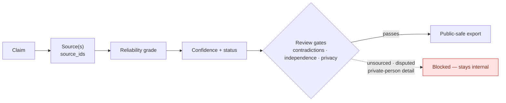

# Case Ledger

The JSONL ledger at `data/cases/<case_slug>/records/*.jsonl` is canonical.
Everything else — retrieval indexes, workflow memory, parse artifacts, and
exports — is rebuildable from it. Each record type has one schema in
`docs/schemas/`.

## Workspace layout

A case workspace at `data/cases/<case_slug>/` contains:

- `case.json` — case metadata.
- `raw/` — captured source text and files.
- `records/*.jsonl` — append-oriented ledger records: sources, entities,
  places, artifacts, claims, events, event links, relationships, source
  spans, quotes, redactions, and research actions.
- `staging/extractions/` — LLM extraction packets awaiting review and import.
- `exports/` — generated output.

## Evidence chain

Every public-facing claim should reduce to:

```text
Claim → source(s) → reliability grade → confidence → privacy review → visualization output
```

If that chain breaks, the claim stays out of the public script.



## Record conventions

- `research_actions.jsonl` is an audit log for workflow steps such as source intake, extraction import, source-independence review, and public-export review.
- Use `records/source_spans.jsonl` plus `source_span_ids` on claims, events, relationships, event links, quotes, or artifacts when page, paragraph, timestamp, line, section, or URL-fragment locators are needed.
- Use `assertion_type` to preserve how a source frames an assertion: `source_stated_fact`, `allegation`, `denial`, `court_finding`, `self_report`, `biography_claim`, `lead_only`, or `expert_context`.
- Use `independence_group` on sources to avoid treating repeated wire stories, copied articles, shared dockets, or common archive packets as independent corroboration.
- Use `references/controlled_vocabularies.md` and `references/topic_extraction_templates.md` from the skill directory before creating new terms.
- Use JSON Schemas from `docs/schemas/` when validating machine-facing records.
- Before public output, run `validate`, review `public_export` and `privacy_review`, and use `audit-public-export` when available. `report` and `export-analysis-charts` provide the fallback public-readiness review surface.

## Validation and audit commands

`tcr.py` provides the review-gate surface over the ledger: `validate`,
`audit-public-export`, `audit-privacy-redactions`,
`audit-source-independence`, `audit-contradictions`, and
`review-narrative-readiness`. Run them from the repo root against the case
path; the [Public Output Readiness](../runbooks/cases/public-output-readiness.md)
runbook sequences them before any public export.

## Related

- [Skill API Spec](../skill-api-spec.md)
- [Schemas](../../schemas/README.md)
- [Case Workflow](../runbooks/cases/case-workflow.md)
- [Public Output Readiness](../runbooks/cases/public-output-readiness.md)
