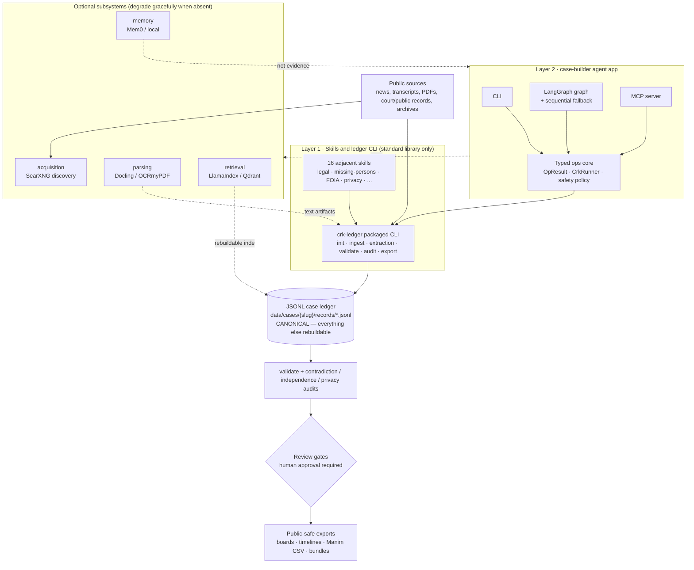

# System Overview

This is the full architecture write-up that the README summarizes. It covers
the two implementation layers, the canonical case ledger they share, the
optional subsystems, and the review gates between raw sources and public
output.

## The two-layer model

CRK has two implementation layers. Both read and write the same JSONL case
ledger, and neither is allowed to bypass its contract:

1. **Skills and ledger CLI** — `crk-ledger`
   is a standard-library-only packaged CLI implementing the complete
   ledger contract: case init, URL ingest, extraction staging and import,
   validation, audits, and exports. Sixteen adjacent skills under
   `.agents/skills/` (legal-court-records, missing-persons-case,
   privacy-redaction-audit, …) extend the same case ledger with
   domain-specific packets. See [Agent Skills](../integrations/agent-skills.md).
2. **`src/`** — the agent app. Its frontends (CLI, LangGraph
   workflow, MCP server) never touch `crk-ledger` or the ledger directly; they go
   through the typed ops core in `ops/` (`OpResult`, `CrkRunner`, and the
   safety `policy`). The graph runner stops at a human review gate. See
   [Case Builder & LangGraph](case-builder-langgraph.md).

## Architecture diagram

## The canonical ledger

A case lives at `data/cases/<case_slug>/`:

- `records/*.jsonl` — append-oriented records, one JSON Schema per record type
  in `docs/schemas/`.
- `staging/extractions/` — LLM extraction packets awaiting review and import.
- `exports/` — generated output.

The ledger is canonical; retrieval indexes, workflow memory, and parse
artifacts are rebuildable and are never treated as evidence. Record-level
conventions live in [Case Ledger](case-ledger.md), and the machine-facing CLI
and payload contract lives in the [Skill API Spec](../skill-api-spec.md).

## Optional subsystems

Each subsystem sits behind an optional extra in `pyproject.toml`, imports
lazily, and skips its tests when the dependency is absent. The core `crk-ledger`
CLI and base case-builder CLI run on the standard library alone.

| Subsystem | Extra | Provides |
| --- | --- | --- |
| `acquisition/` | `web-local` | SearXNG source discovery |
| `parsing/` | `documents` | Docling parsing, OCRmyPDF OCR |
| `retrieval/` | `retrieval` | LlamaIndex/Qdrant local RAG indexes |
| `memory/` | `memory-local` | Mem0 OSS or local workflow memory |

The self-hosted container stack (SearXNG, Qdrant, Ollama, MCP, …) that backs
these subsystems is operated via the
[Self-Hosted Deployment runbook](../runbooks/setup/self-hosted-deployment.md).

## Data flow

Sources enter through ingest (or SearXNG discovery), become source records
with reliability grades and hashes, and are extracted into claims, entities,
events, and relationships via staged extraction packets. Validation and the
contradiction, source-independence, and privacy audits gate what reaches
public-safe exports; anything unsourced, disputed, or private stays internal.
The full loop is the [Case Workflow runbook](../runbooks/cases/case-workflow.md).

## Design invariants

- The JSONL ledger is canonical; everything else is rebuildable from it.
- Frontends never bypass the ops core; the ops core never bypasses `crk-ledger`.
- AI-generated summaries are never evidence; extraction packets are staged
  for review before import.
- Optional dependencies degrade gracefully — no required third-party packages
  for the core workflow.
- Lane and template vocabulary is registry-first: `docs/registry/` is
  canonical, reference tables are generated, and governance tests catch drift.
- Governance tests bound module size and repository shape
  (`tests/quality/governance/`).

## Where to go next

| Topic | Reference |
| --- | --- |
| Ledger records and conventions | [Case Ledger](case-ledger.md) |
| Skill invocation and lane routing | [Agent Skills](../integrations/agent-skills.md) |
| Machine-facing CLI/JSONL contract | [Skill API Spec](../skill-api-spec.md) |
| LangGraph workflow boundary | [Case Builder & LangGraph](case-builder-langgraph.md) |
| MCP server integration | [MCP Server](../integrations/mcp-server.md) |
| Operator procedures | [Runbooks](../runbooks/README.md) |
