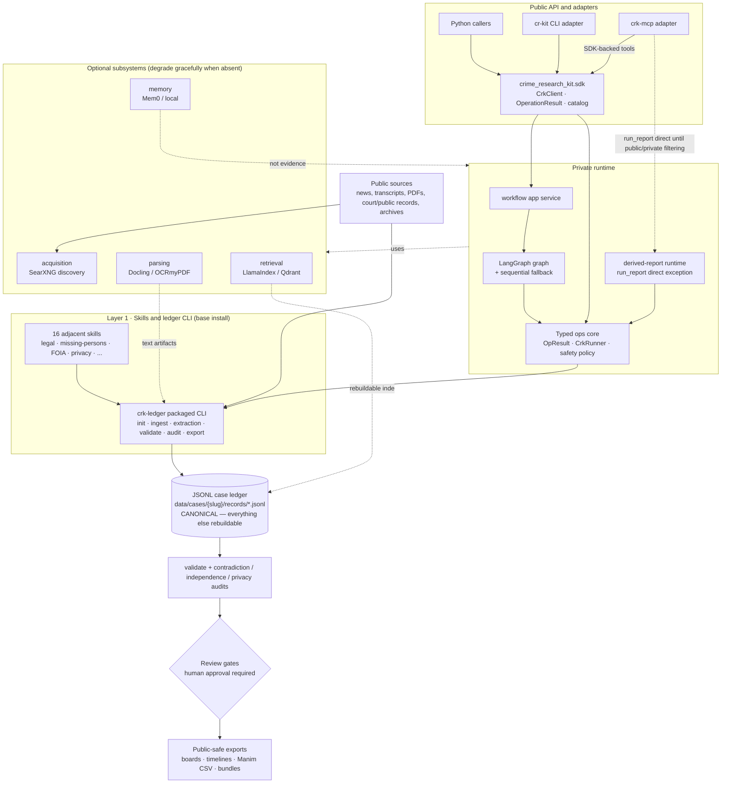

# System Overview

This is the full architecture write-up that the README summarizes. It covers
the public SDK and adapter surfaces, the private runtime layers, the canonical
case ledger they share, the optional subsystems, and the review gates between
raw sources and public output.

## Public Python Boundary

The public Python API is `crime_research_kit.sdk`. Python integrations should
use `CrkClient`, `CrkContext`, case-scoped clients, `OperationResult`, and the
operation catalog from that namespace.

The packaged private runtime modules now live under
`crime_research_kit._runtime`. That namespace exists for console scripts and
app internals; it is not a supported SDK import and may be reshaped before 1.0.
Top-level `adapters`, `core`, and `pipeline` imports are not compatibility
promises. See [Python SDK Boundary](../integrations/python-sdk.md).

`cr-kit` and `crk-mcp` are adapter surfaces over SDK/catalog-backed operations.
`crk-ledger` remains the ledger CLI contract. MCP resources and prompts stay
MCP-specific; `run_report` remains a direct derived-report path until the
evidence-board report has explicit public/private filtering semantics.

## The two-layer model

CRK has two implementation layers. Both read and write the same JSONL case
ledger, and neither is allowed to bypass its contract:

1. **Skills and ledger CLI** — `crk-ledger`
   is a base-install packaged CLI implementing the complete
   ledger contract: case init, URL ingest, extraction staging and import,
   validation, audits, and exports. Sixteen adjacent skills under
   `.agents/skills/` (legal-court-records, missing-persons-case,
   privacy-redaction-audit, …) extend the same case ledger with
   domain-specific packets. See [Agent Skills](../integrations/agent-skills.md).
2. **Private runtime packages** — the agent app under `src/`. CLI/MCP adapters
   call SDK facades where operations have been promoted; the SDK delegates into
   the app service and typed ops core (`OpResult`, `CrkRunner`, and the safety
   `policy`). Runtime modules may use the ledger CLI, but public Python callers
   do not import those modules directly. The graph runner stops at a human
   review gate. See [Case Builder & LangGraph](case-builder-langgraph.md).

## Architecture diagram

## The canonical ledger

A case lives at `data/cases/<case_slug>/`:

- `records/*.jsonl` — append-oriented records, one JSON Schema per record type
  in `docs/schemas/`.
- `staging/extractions/` — LLM extraction packets awaiting review and import.
- `exports/` — generated output.

The ledger is canonical; retrieval indexes, workflow memory, and parse
artifacts are rebuildable and are never treated as evidence. Record-level
conventions live in [Case Ledger](case-ledger.md), and the machine-facing CLI
and payload contract lives in the [Skill API Spec](../skill-api-spec.md).

## Optional subsystems

Each subsystem sits behind an optional extra in `pyproject.toml`, imports
lazily, and skips its tests when the dependency is absent. The core `crk-ledger`
path and base case-builder commands avoid optional extras unless a feature
explicitly needs one.

| Subsystem | Extra | Provides |
| --- | --- | --- |
| `acquisition/` | `web-local` | SearXNG source discovery |
| `parsing/` | `documents` | Docling parsing, OCRmyPDF OCR |
| `retrieval/` | `retrieval` | LlamaIndex/Qdrant local RAG indexes |
| `memory/` | `memory-local` | Mem0 OSS or local workflow memory |

The self-hosted container stack (SearXNG, Qdrant, Ollama, MCP, …) that backs
these subsystems is operated via the
[Self-Hosted Deployment runbook](../runbooks/setup/self-hosted-deployment.md).

## Data flow

Sources enter through ingest (or SearXNG discovery), become source records
with reliability grades and hashes, and are extracted into claims, entities,
events, and relationships via staged extraction packets. Validation and the
contradiction, source-independence, and privacy audits gate what reaches
public-safe exports; anything unsourced, disputed, or private stays internal.
The full loop is the [Case Workflow runbook](../runbooks/cases/case-workflow.md).

## Design invariants

- The JSONL ledger is canonical; everything else is rebuildable from it.
- Public Python callers use `crime_research_kit.sdk`; runtime packages are not
  public SDK imports.
- CLI/MCP adapters use SDK/catalog-backed operations where promoted, and do not
  treat runtime modules as public API.
- Runtime operations never bypass the ledger contract; canonical writes flow
  through `crk-ledger` or the same ledger-safe command path.
- AI-generated summaries are never evidence; extraction packets are staged
  for review before import.
- Optional dependencies degrade gracefully — no optional service packages are
  required for the core workflow.
- Lane and template vocabulary is registry-first: `docs/registry/` is
  canonical, reference tables are generated, and governance tests catch drift.
- Governance tests bound module size and repository shape
  (`tests/quality/governance/`).

## Where to go next

| Topic | Reference |
| --- | --- |
| Ledger records and conventions | [Case Ledger](case-ledger.md) |
| Public Python import boundary | [Python SDK Boundary](../integrations/python-sdk.md) |
| Skill invocation and lane routing | [Agent Skills](../integrations/agent-skills.md) |
| Machine-facing CLI/JSONL contract | [Skill API Spec](../skill-api-spec.md) |
| LangGraph workflow boundary | [Case Builder & LangGraph](case-builder-langgraph.md) |
| MCP server integration | [MCP Server](../integrations/mcp-server.md) |
| Operator procedures | [Runbooks](../runbooks/README.md) |
